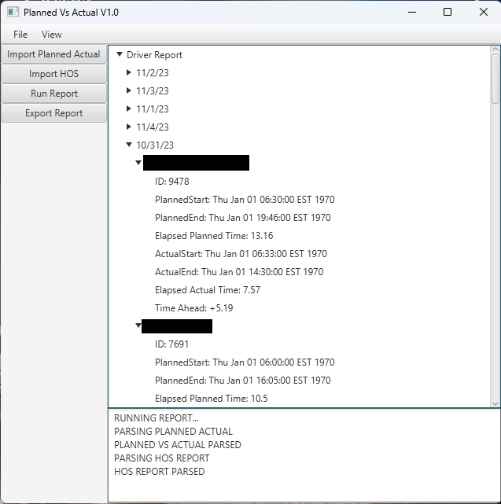

# Planned-Vs-Actual-Report
A Planned Vs. Actual report generator

# Details
This application is meant to allow users of oneview2.pedigreetechnologies.com to create a more accurate Planned Vs. Actual report than what is provided by default.
This is done by cross referencing the already available Planned vs. Actual Jobs by Driver from Pedigree Technologies with their HOS Records Timecard Export Report.

Both of these reports are cross referenced and stores into a 2d-matrix indexed by Date and Driver ID.
As both reports contain part of the information needed for final calculations they are parsed as follows:

Planned vs. Actual Jobs by Driver
  - Driver ID
  - Route Date
  - Planned Start
  - Planned End

HOS Records Timecard Export Report
  - Actual End
  - Actual Start
  - Route ID

After this data is cached, simple subtraction is done to find the actual time taken by drivers to complete their routes.

Finally, the data can be exported into an Excel friendly CSV file.

# Images

  

  

    <em>employee names censored</em>
  

